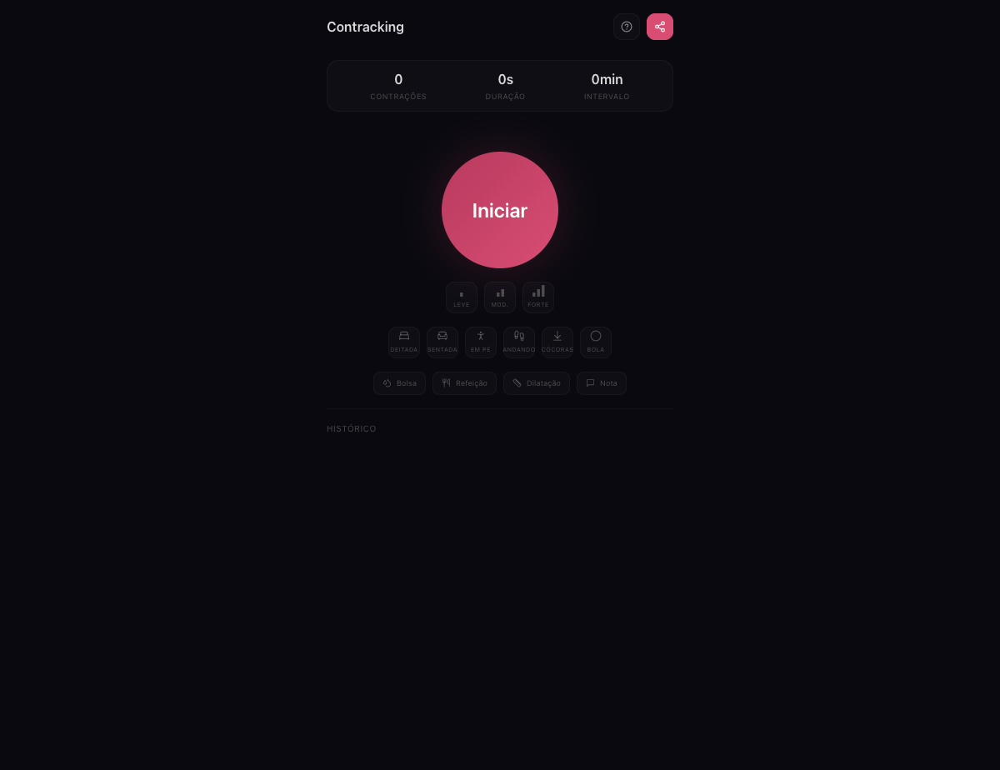
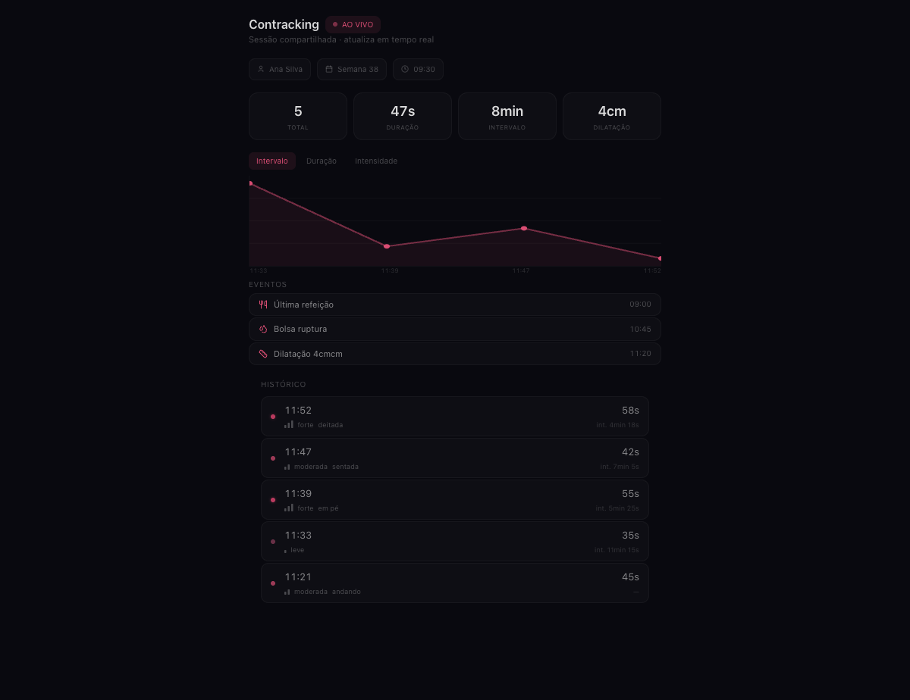
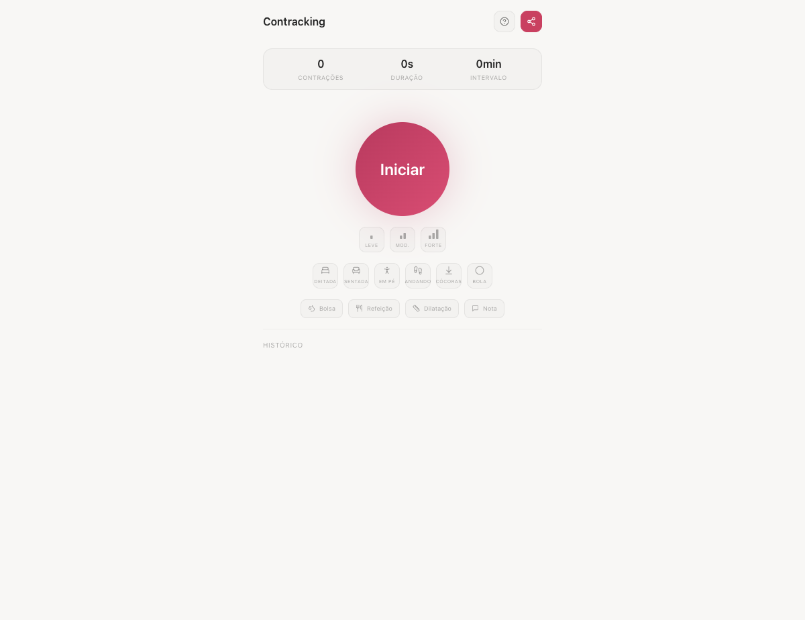
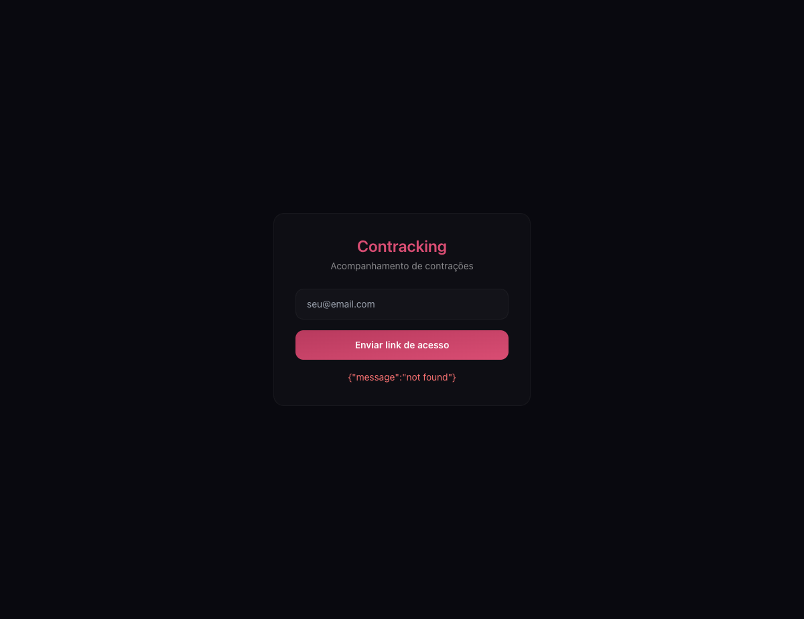

# Contracking

Contraction tracking app for labor. Offline-first PWA with cloud sync, shareable public link for the doctor.

## Screenshots

| Dark Mode | Public View |
|-----------|-------------|
|  |  |

| Light Mode | Login |
|------------|-------|
|  |  |

## Features

- **Offline-first** — works instantly without login or network, data in localStorage
- **One-tap tracking** — big button to start/stop contractions, timer runs automatically
- **Optional details** — intensity (bars), position (icons), notes — all optional, zero typing required
- **Events** — log water break, meals, dilation, notes with a single tap
- **Metrics tab** — stats, charts, regularity detection, 5-1-1 pattern alerts
- **Date filters** — today, 3d, 7d, 30d, custom range
- **Cloud sync** — login to sync across devices, bidirectional merge with tombstones
- **Cross-device** — same email syncs data between phone, tablet, desktop
- **Public link** — share a live-updating URL with the doctor (no auth required to view)
- **PWA** — installable, Add to Home Screen
- **Dark/Light** — follows system preference, OLED-friendly Abyss dark mode
- **Smart notifications** — web push at 2min (warning), 3min (urgent), 5min (auto-stop)
- **Persist across refresh** — timer resumes if you refresh the page
- **Import/Export** — JSON export/import for backup and device transfer
- **Magic link + OTP** — login via email link or 6-digit code
- **Cloudflare Turnstile** — captcha on login

## Tech Stack

- **Runtime**: [Bun](https://bun.sh)
- **API**: [Cloudflare Workers](https://workers.cloudflare.com)
- **Database**: [Cloudflare D1](https://developers.cloudflare.com/d1/) (SQLite)
- **Frontend**: React 19 + Tailwind CSS
- **Auth**: Magic link + OTP via [Resend](https://resend.com)
- **Captcha**: [Cloudflare Turnstile](https://www.cloudflare.com/products/turnstile/)
- **Lint/Format**: [Biome](https://biomejs.dev)
- **Icons**: [Lucide](https://lucide.dev)
- **Tests**: Bun test (193 tests)

## Project Structure

```
contracking-app/
├── apps/
│   ├── api/              # Cloudflare Worker
│   └── dashboard/        # React 19 + Tailwind (PWA)
├── libs/
│   └── shared/           # Types, enums, constants, stats
├── deploy.sh             # Production deploy script
├── package.json          # Bun workspaces
├── tsconfig.base.json
└── biome.json
```

## Getting Started

### Prerequisites

- [Bun](https://bun.sh) v1.2+
- [Cloudflare account](https://dash.cloudflare.com) (free tier works)
- [Resend account](https://resend.com) (free tier: 100 emails/day)

### Setup

```bash
bun install

# API env
cp apps/api/.dev.vars.sample apps/api/.dev.vars
# Edit .dev.vars with your Resend API key and Turnstile secret

# Dashboard env
cp apps/dashboard/.env.sample apps/dashboard/.env
# Edit .env with API URL and Turnstile site key

# Run D1 migrations locally
cd apps/api && bunx wrangler d1 migrations apply contracking --local

# Start API (terminal 1)
cd apps/api && bunx wrangler dev --port 8788

# Start dashboard (terminal 2)
cd apps/dashboard && bun run dev
```

Open http://localhost:3001 in your browser.

### Full Check

```bash
bun run full-check    # Lint + typecheck + 193 tests
```

### Deploy

```bash
bash deploy.sh
```

The deploy script:
1. Gets git hash as version
2. Sets API_VERSION secret on the Worker
3. Deploys API via `wrangler deploy`
4. Builds dashboard with env vars from `.env`
5. Deploys dashboard to Cloudflare Pages

### Manual Deploy

```bash
# API
cd apps/api
CLOUDFLARE_API_TOKEN="" bunx wrangler d1 migrations apply contracking --remote
CLOUDFLARE_API_TOKEN="" bunx wrangler deploy

# Dashboard
cd apps/dashboard
rm -rf dist && bun run build
CLOUDFLARE_API_TOKEN="" CLOUDFLARE_ACCOUNT_ID=YOUR_ID bunx wrangler pages deploy dist --project-name=contracking --branch=main
```

## Architecture

### Offline-First

All tracking works offline via localStorage. No login or network required to use the app. Data syncs to cloud when authenticated.

### Sync

- Contractions and events are linked to `user_id` (no session ID)
- Push: sends unsynced items to cloud via POST /sync
- Pull: fetches all user data via GET /my-session
- Merge: last-write-wins with tombstones for deletes
- Auto-sync every 30s when authenticated + on tab focus + on reconnect

### Auth

- Magic link email with 6-digit OTP code
- Session cookie (SameSite=None for cross-subdomain)
- Auth token in localStorage (for PWA standalone mode)
- Auth token also sent in POST body (fallback)

## License

[MIT](LICENSE)
